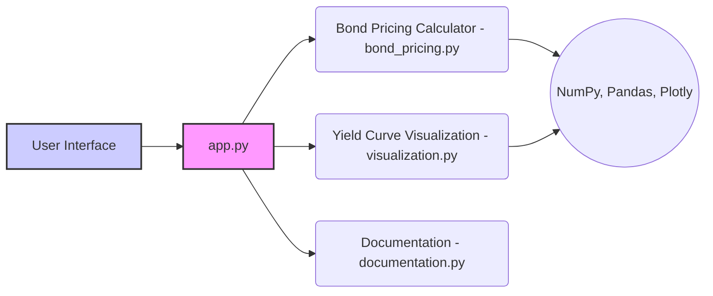

id: 67ddba6814d6b2f98be31d87_documentation
summary: Bond Pricing & Yield Curve Analysis Documentation
feedback link: https://docs.google.com/forms/d/e/1FAIpQLSfWkOK-in_bMMoHSZfcIvAeO58PAH9wrDqcxnJABHaxiDqhSA/viewform?usp=sf_link
environments: Web
status: Published
# QuCreate Streamlit Lab: A Comprehensive Guide to Bond Pricing and Visualization

This codelab provides a detailed walkthrough of the QuCreate Streamlit Lab, a multi-page application designed for educational purposes. It demonstrates bond pricing calculations, yield curve visualization, and provides comprehensive documentation. By the end of this codelab, you'll understand the application's architecture, functionality, and how to extend it for your own projects. This application is useful for anyone learning about or working with fixed income securities, financial modeling, and interactive data visualization.

## Understanding the Application's Architecture
Duration: 00:05

The QuCreate Streamlit Lab is structured as a multi-page application using Streamlit's built-in features. The main entry point is `app.py`, which handles navigation and page routing. The core functionalities are modularized into separate pages within the `pages` directory:

*   `bond_pricing.py`: Contains the bond pricing calculator.
*   `visualization.py`: Implements the yield curve visualization.
*   `documentation.py`: Provides detailed documentation about the application and bond pricing concepts.

Here's a high-level architectural diagram:



## Setting up the Environment
Duration: 00:02

Before diving into the code, ensure you have the following:

*   Python 3.6 or higher
*   Streamlit
*   NumPy
*   Pandas
*   Plotly

You can install the necessary packages using pip:

```console
pip install streamlit numpy pandas plotly
```

## Exploring `app.py`: The Main Application
Duration: 00:05

The `app.py` file serves as the entry point for the Streamlit application. It configures the page layout, adds a sidebar for navigation, and routes users to different pages based on their selection.

```python
import streamlit as st
from pages import bond_pricing, visualization, documentation

st.set_page_config(page_title="QuCreate Streamlit Lab", layout="wide")
st.sidebar.image("https://www.quantuniversity.com/assets/img/logo5.jpg")
st.sidebar.divider()
st.title("QuLab")
st.divider()

# Navigation sidebar for multi-page app
page = st.sidebar.selectbox("Navigation", ["Bond Pricing Calculator", "Yield Curve Visualization", "Documentation"])

if page == "Bond Pricing Calculator":
    bond_pricing.app()
elif page == "Yield Curve Visualization":
    visualization.app()
elif page == "Documentation":
    documentation.app()

st.divider()
st.write("© 2025 QuantUniversity. All Rights Reserved.")
st.caption("The purpose of this demonstration is solely for educational use and illustration. "
           "To access the full legal documentation, please visit this link. Any reproduction of this demonstration "
           "requires prior written consent from QuantUniversity.")
```

Key aspects of `app.py`:

*   `st.set_page_config()`: Configures the page title and layout.
*   `st.sidebar.image()`: Adds an image to the sidebar (QuantUniversity logo in this case).
*   `st.sidebar.selectbox()`: Creates a dropdown menu in the sidebar for navigation.
*   Conditional statements:  Based on the selected page, the corresponding `app()` function from the respective module (`bond_pricing`, `visualization`, or `documentation`) is called.
*   Copyright and Caption: Displaying copyright information and a disclaimer.

## Diving into `bond_pricing.py`: Bond Pricing Calculator
Duration: 00:10

This module implements a bond pricing calculator. Users can input bond parameters like coupon rate, maturity, face value, and yield to maturity (YTM), and the application calculates the bond's price.

```python
import streamlit as st
import numpy as np

def calculate_bond_price(coupon_rate, maturity, face_value, ytm):
    """
    Calculate the price of a bond based on the input parameters.
    Coupon Payment = coupon_rate * face_value
    Price = (Coupon Payment) * (1 - (1+ytm)^(-maturity)) / ytm + face_value / (1+ytm)^(maturity)
    """
    coupon_payment = coupon_rate * face_value
    # Handle zero yield to maturity
    if ytm == 0:
        price = coupon_payment * maturity + face_value
    else:
        price = coupon_payment * (1 - (1+ytm)**(-maturity)) / ytm + face_value * (1+ytm)**(-maturity)
    return price

def app():
    st.header("Bond Pricing Calculator")
    st.markdown("Enter the bond parameters below to calculate its price:")
    coupon_rate = st.number_input("Coupon Rate (e.g., 0.05 for 5%)", min_value=0.0, value=0.05, step=0.01, format="%.2f")
    maturity = st.number_input("Maturity (years)", min_value=1, value=10, step=1)
    face_value = st.number_input("Face Value", min_value=1, value=1000, step=1)
    ytm = st.number_input("Yield to Maturity (YTM) (e.g., 0.04 for 4%)", min_value=0.0, value=0.04, step=0.01, format="%.2f")
    
    if st.button("Calculate Price"):
        price = calculate_bond_price(coupon_rate, maturity, face_value, ytm)
        st.success(f"Calculated Bond Price: ${price:,.2f}")
    
    st.markdown("""
    ### Explanation of the Bond Pricing Formula
    The bond price is computed using the formula:
    
    Price = (Coupon Payment) * (1 - (1+YTM)^(-Maturity))/YTM + Face Value / (1+YTM)^(Maturity)
    
    where:
    - **Coupon Payment** = Coupon Rate * Face Value
    - **Maturity** is the number of years until maturity.
    - **YTM** is the Yield to Maturity or discount rate.
    """)
```

Key components of `bond_pricing.py`:

*   `calculate_bond_price()`: This function calculates the bond price based on the standard bond pricing formula.  It also includes a special case to handle when YTM is zero to avoid division by zero errors.
*   `st.header()` and `st.markdown()`:  Used for displaying text and explanations on the page.
*   `st.number_input()`: Creates numerical input fields for users to enter bond parameters. The `format` parameter ensures the input is displayed with two decimal places.
*   `st.button()`: A button that triggers the bond price calculation.
*   `st.success()`: Displays the calculated bond price in a green success message.
*   Markdown Explanation: Provides a clear explanation of the bond pricing formula.

## Exploring `visualization.py`: Yield Curve Visualization
Duration: 00:15

This module generates an interactive Plotly chart visualizing the relationship between bond prices and YTM. It allows users to adjust parameters and observe how the yield curve changes dynamically.

```python
import streamlit as st
import numpy as np
import pandas as pd
import plotly.express as px

def calculate_bond_price(coupon_rate, maturity, face_value, ytm):
    coupon_payment = coupon_rate * face_value
    if ytm == 0:
        price = coupon_payment * maturity + face_value
    else:
        price = coupon_payment * (1 - (1+ytm)**(-maturity)) / ytm + face_value * (1+ytm)**(-maturity)
    return price

def app():
    st.header("Yield Curve Visualization")
    st.markdown("This page allows you to visualize the bond price variations as YTM changes.")
    
    coupon_rate = st.number_input("Coupon Rate (e.g., 0.05 for 5%)", min_value=0.0, value=0.05, step=0.01, format="%.2f")
    maturity = st.number_input("Maturity (years)", min_value=1, value=10, step=1)
    face_value = st.number_input("Face Value", min_value=1, value=1000, step=1)
    ytm_start = st.number_input("Starting YTM", min_value=0.0, value=0.01, step=0.01, format="%.2f")
    ytm_end = st.number_input("Ending YTM", min_value=0.0, value=0.10, step=0.01, format="%.2f")
    num_points = st.slider("Number of Points", min_value=10, max_value=200, value=50)
    
    if ytm_start >= ytm_end:
        st.error("Starting YTM must be less than Ending YTM.")
        return
    
    ytm_values = np.linspace(ytm_start, ytm_end, num_points)
    prices = [calculate_bond_price(coupon_rate, maturity, face_value, ytm) for ytm in ytm_values]
    
    df = pd.DataFrame({
        "YTM": ytm_values,
        "Bond Price": prices
    })
    
    fig = px.line(df, x="YTM", y="Bond Price", title="Bond Price vs Yield to Maturity",
                  labels={"YTM": "Yield to Maturity", "Bond Price": "Bond Price"})
    fig.update_traces(mode='lines+markers', hovertemplate="YTM: %{x:.2f}<br>Bond Price: $%{y:.2f}")
    st.plotly_chart(fig, use_container_width=True)
    
    st.markdown("""
    ### Interactive Chart Details
    The above chart updates dynamically as you adjust the input parameters. Hover over any point to view detailed information.
    """)
```

Key components of `visualization.py`:

*   `calculate_bond_price()`:  Reuses the bond pricing calculation function from `bond_pricing.py`.  This enforces consistency across the application.
*   `st.number_input()` and `st.slider()`:  Provides UI elements for users to control the YTM range and the number of data points in the chart.
*   Input Validation: Checks if `ytm_start` is less than `ytm_end` and displays an error message if not. This prevents invalid chart generation.
*   `np.linspace()`: Creates an array of evenly spaced YTM values within the specified range.
*   List Comprehension:  Efficiently calculates the bond price for each YTM value.
*   `pd.DataFrame()`:  Creates a Pandas DataFrame to store the YTM values and corresponding bond prices.
*   `plotly.express.line()`:  Generates an interactive line chart using Plotly.
*   `fig.update_traces()`: Customizes the chart's appearance and adds a hover template for detailed information.
*   `st.plotly_chart()`:  Displays the Plotly chart in the Streamlit application.
*   Interactive Chart Details: Explains how the chart responds to changes and displays data on hover.

## Reviewing `documentation.py`: Application Documentation
Duration: 00:05

This module provides documentation for the application, explaining its features, bond pricing formula, and usage instructions.

```python
import streamlit as st

def app():
    st.header("Documentation")
    st.markdown("""
    ## Bond Pricing Visualizer Documentation

    This multi-page Streamlit application is designed for educational purposes to illustrate bond pricing and yield curve analysis.

    ### Features
    - **Bond Pricing Calculator**: Compute the price of a bond using user-defined parameters.
    - **Yield Curve Visualization**: Interactive Plotly chart showcasing how bond prices change with varying YTM values.
    - **Documentation**: Detailed explanations of the formulas, methodology, and interactive visualizations.

    ### Bond Pricing Formula
    The bond price is calculated using the formula:
    
    Price = (Coupon Payment) * (1 - (1 + YTM)^(-Maturity)) / YTM + Face Value / (1 + YTM)^(Maturity)
    
    where:
    - **Coupon Payment** = Coupon Rate * Face Value
    - **Maturity** is the number of years until maturity.
    - **YTM** is the yield to maturity.

    ### How to Use
    1. Navigate using the sidebar.
    2. Input the required parameters.
    3. View the calculated bond price or interactive visualization.
    
    Enjoy exploring the fundamentals of bond pricing!
    """)
```

Key components of `documentation.py`:

*   `st.header()` and `st.markdown()`:  Used to present the documentation content in a structured and readable format.
*   Features List: Clearly outlines the key functionalities of the application.
*   Bond Pricing Formula: Provides the formula and explanation.
*   How to Use: Instructions on how to navigate and interact with the application.

## Running the Application
Duration: 00:02

To run the application, navigate to the directory containing `app.py` in your terminal and execute the following command:

```console
streamlit run app.py
```

This will start the Streamlit server and open the application in your web browser.

## Testing the Application
Duration: 00:10

The application includes unit tests and integration tests.

**Unit Tests (`tests/test_bond_pricing.py`)**:

```python
import unittest
from pages.bond_pricing import calculate_bond_price

class TestBondPricing(unittest.TestCase):
    def test_zero_ytm(self):
        # When YTM is 0, bond price should equal coupon_payment*maturity + face_value.
        price = calculate_bond_price(0.05, 10, 1000, 0)
        expected = 0.05 * 1000 * 10 + 1000
        self.assertAlmostEqual(price, expected, places=2)
        
    def test_nonzero_ytm(self):
        coupon_rate = 0.05
        maturity = 10
        face_value = 1000
        ytm = 0.04
        price = calculate_bond_price(coupon_rate, maturity, face_value, ytm)
        coupon_payment = coupon_rate * face_value
        expected = coupon_payment * (1 - (1+ytm)**(-maturity))/ytm + face_value*(1+ytm)**(-maturity)
        self.assertAlmostEqual(price, expected, places=2)

if __name__ == '__main__':
    unittest.main()
```

This tests the `calculate_bond_price` function, specifically handling the case where YTM is zero and a general case with a non-zero YTM.

**Integration Tests (`tests/test_integration.py`)**:

```python
import unittest
from pages import bond_pricing, visualization, documentation

class TestIntegration(unittest.TestCase):
    def test_bond_pricing_page(self):
        try:
            bond_pricing.app()
        except Exception as e:
            self.fail(f"bond_pricing.app() raised an exception: {e}")
            
    def test_visualization_page(self):
        try:
            visualization.app()
        except Exception as e:
            self.fail(f"visualization.app() raised an exception: {e}")
            
    def test_documentation_page(self):
        try:
            documentation.app()
        except Exception as e:
            self.fail(f"documentation.app() raised an exception: {e}")

if __name__ == '__main__':
    unittest.main()
```

This ensures that each page (`bond_pricing`, `visualization`, `documentation`) can be loaded without errors.

To run the tests, navigate to the `tests` directory and run:

```console
python -m unittest test_bond_pricing.py
python -m unittest test_integration.py
```

## Dockerization
Duration: 00:08

The application is dockerized to allow for easy deployment and portability. The `Dockerfile` (assumed to be in the project root) would contain instructions to set up the environment and run the application. The provided `.github/workflows/build_docker_and_push.yml` workflow automates the process of building and pushing the Docker image to Docker Hub when a new tag is pushed to the repository.

**Dockerfile (Example)**:

```dockerfile
FROM python:3.9-slim-buster

WORKDIR /app

COPY . .

RUN pip install --no-cache-dir -r requirements.txt

EXPOSE 8501

CMD ["streamlit", "run", "app.py"]
```

**Explanation**:

*   `FROM python:3.9-slim-buster`: Uses a lightweight Python 3.9 image as the base.
*   `WORKDIR /app`: Sets the working directory inside the container.
*   `COPY . .`: Copies all files from the current directory to the `/app` directory in the container.
*   `RUN pip install --no-cache-dir -r requirements.txt`: Installs the Python dependencies. You'll need a `requirements.txt` file listing all the dependencies (e.g., streamlit, numpy, pandas, plotly).
*   `EXPOSE 8501`: Exposes port 8501, the default Streamlit port.
*   `CMD ["streamlit", "run", "app.py"]`: Specifies the command to run when the container starts.

## CI/CD Pipeline

The `.github/workflows/build_docker_and_push.yml` file defines a GitHub Actions workflow to automatically build and push a Docker image to Docker Hub when a tagged commit is pushed to the repository.

```yaml
name: Build and Push to Docker Hub

on:
  push:
    tags:
      - "v*.*.*"
  
jobs:
  build-and-push:
    runs-on: ubuntu-latest

    steps:
      - name: Check out repository
        uses: actions/checkout@v2

      - name: Log in to Docker Hub
        run: |
          echo "${{ secrets.DOCKERHUB_PASSWORD }}" | docker login -u "${{ secrets.DOCKERHUB_USERNAME }}" --password-stdin

      - name: Build Docker image
        run: |
          docker build -t None/67ddba6814d6b2f98be31d87_streamlit_app:latest .

      - name: Push Docker image
        run: |
          docker push None/67ddba6814d6b2f98be31d87_streamlit_app:latest
```

**Explanation**:

*   `name`: Sets the name of the workflow.
*   `on`: Defines the trigger for the workflow (pushing tags matching `v*.*.*`).
*   `jobs`: Defines the jobs to be executed.
*   `build-and-push`: The job to build and push the Docker image.
*   `runs-on`: Specifies the operating system for the job.
*   `steps`: Defines the steps within the job.
    *   `Check out repository`: Checks out the repository.
    *   `Log in to Docker Hub`: Logs in to Docker Hub using secrets stored in GitHub.
    *   `Build Docker image`: Builds the Docker image.
    *   `Push Docker image`: Pushes the Docker image to Docker Hub.

<aside class="positive">
<b>Best Practice:</b> Always store sensitive information like Docker Hub credentials as secrets in GitHub Actions for security.
</aside>

## Customization and Extension
Duration: 00:10

The application is designed to be easily customizable and extensible. Here are some ideas for extending its functionality:

*   **Adding More Bond Types:** Implement pricing models for different types of bonds (e.g., zero-coupon bonds, callable bonds).
*   **Integrating Data Sources:** Fetch real-time yield curve data from external APIs.
*   **Implementing Risk Metrics:** Calculate bond duration, convexity, and other risk metrics.
*   **Enhancing Visualization:** Add more interactive features to the yield curve visualization, such as the ability to compare different yield curves.
*   **Adding more tests**: Add tests for the visualization and documentation pages. Also add more unit tests for edge cases.

## Conclusion
Duration: 00:02

This codelab provided a comprehensive overview of the QuCreate Streamlit Lab, covering its architecture, functionality, and how to extend it. By understanding the concepts and code presented here, you can build your own financial applications and interactive data visualizations using Streamlit.
